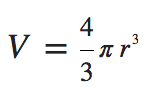

@annotation:tour intro
#FUNCTIONS, CALLBACKS, OBJECTS & GOOGLE MAPS
In this module we are going to build a small Google Maps application as a way of introducing you to *functions*, *callbacks* and *objects*.

We are going to throw several new and important things at you in this module, so don't skip anything as we will be building on this in later modules.


@annotation:tour targetapp
#Target Application
We are finally going to do something more interesting. 

Watch the video below and you will see the application that we will be building in this module.


- it will show a map 
- it should be located at your current location (you will need to give permission when the browser prompts you)
- it places a marker on the map at your location
- if you click on the marker, it will show a pop-up message

@annotation:tour functions
#Functions
Sorry to do this to you, but we need to introduce you to 2 final and important programming constructs before we get on the Google Maps application.

Functions are very powerful and actually rather easy to understand.

>Select 'Functions' from the  Rocket menu at the top to load some code or restore it if you mess it up.

Now take a look at the code and preview it. We'll disect the code to see what functions are all about.

@annotation:tour funcintro
#What is a function
A function is simply a piece of code that you wrap up in a way that can be called by your code in other locations.

There are a couple of reasons why you should use functions rather than simply having it 'inline'.

- if your code inside one function gets long and unreadable, it is good practice to remove logical chunks of code into a separate function and then call that function instead
- if your **ever** have a chunk of code that gets used in more than one place then you should never duplicate your code as you will have to update that code in every place it is used.

##Without a function
Here is a piece of code that calculates the volume of a sphere. The formula for calculating this is



```
var radius1=7, radius2=100;
radius1 = (4*Math.PI*radius1*radius1*radius1)/3);
radius2 = (4*Math.PI*radius2*radius1*radius2)/3);
```

Here we can see how the exact same piece of code is duplicated on each line. If we made a mistake coding the formula, we would have to correct the mistake in both places. If we had it in 100 places, you can imagine the nightmare.

Also, if someone else were to read this code (or you yourself were to read it a few months later), you might not have a clue what it is doing. This is a simple example, but things can get way more complex and unreadable than this.Also

So, this is the way we handle it.

```
function volumeSphere(radius) {
  return (4*Math.PI*radius*radius*radius)/3;
}

myFunc() {
  var radius1=7, radius2=100;
  radius1 = volumeSphere(radius1);
  radius2 = volumeSphere(radius2);
}
```

Now you can see how much better this *looks*. Furthermore, if I make a mistake with my formula, I simply correct the `volumeSphere` function once without having to worry about the many places it might get called from.

@annotation:tour parms
#Function Parameters
Let's look at the `volumeSphere` function again

```
function volumeSphere(radius) {
  return (4*Math.PI*radius*radius*radius)/3;
}
```

When we call the function, we need to tell the function what the `radius` of the sphere is. To accomplish this, we create a parameter inside the function definition.

```
volumeSphere(radius)
```

We give the parameter a sensible name and this then behaves like a variable just while the function executes.

Some functions require multiple parameters, so you define them like this

```
function myFunction(latitude, longitude, zoom)
```

We will delve deeper into functions in a later module, but this is the most important thing you need to know for know about function parameters.


@annotation:tour return
#Return values
Here's our `volumeSphere` function again

```
function volumeSphere(radius) {
  return (4*Math.PI*radius*radius*radius)/3;
}
```

We want our function to return the volume, so how do we do this? The answer is we *return* a value from our function.

We could have written it longhand like this

```
function volumeSphere(radius) {
	var volume;
  volume = (4*Math.PI*radius*radius*radius)/3;
  return volume;
}
```

@annotation:tour samplefuncs
#Example code
Now take a look at the example code by opening `example.js`. Here you can see how we have created a few functions, including a new, improved `display` function that takes 3 parameters.

See if you can figure out what is going on.

##Challenge
Look at the `volumeSphere` function and see how we have `radius*radius*radius'. Why not create a new function `cubed()` and make our `volumeSphere` like simpler.


@annotation:tour objects
#Objects
Now for the final thinkg before we tackle our Google Maps application.

>Select 'Objects' from the  Rocket menu at the top to load some code or restore it if you mess it up.

An *object* is a javascript variable that consists of other variables. For example, let's say we have 3 variables `latitude`, `longitude` and `zoomLevel`.

In our case, all 3 are tightly related and belong together as a kind of unit.

If we were to use regular variables, we would do this


```
var latitude = -34.397;
var longitude = 150.644;
var zoomLevel = 8;
```

Instead, we can define an object that looks like this

```
var coord = {
  lat : latitude,
  lng : longitude,
  zoom : 8
};
```

We now have an object called `coord`. `lat` and 'lng` are called *keys*. I can access object keys like this

```
coord.lat = -34.397;
coord.lng = 150.644;
```

However, I can also embed objects within objects, and this can be very useful. For example, I could further refine our `coord` object like this 

```
var combo = {
  coord : {
    lat : latitude,
    lng : longitude,    
  },
  zoom : 8
};
```

I now have a top level object called `combo` and created a *nested* obect called `coord` inside it that just takes care of the real coordinate pair, leaving zoom a part of the top level.

I would reference elements like this

```
combo.coord.lat = -34.397;
combo.zoom = 8;
``

@annotation:tour whyobjects
#Why use an Object
One of the beautiful things about objects is that they Javascript treats them like variables and so they can be passed between functions like this

```
showMap(combo);
```

Rather than this more long winded method.

```
showMap(longitude, latitude, zoom);
```

The usefulness of this becomes evident once you have objects that have tens of elements. Imagine those horribly long parameter lists and function definitions!

@annotation:tour objectsexamples
#Example code
Our Objects sample code shows us using objects. There are some important things to note.

##Object Creation - Method 1
The function `coordinates1` creates an object in a different way to the one we showed earlier. 

- it first creates an empty object with `var coord = {};`
- it then creates new elements one the following 2 lines; Javascript automatically adds these to the newly created object, so they are *dynamically* created

##Object Creation - Method 2
The function `coordinates2` creates an object in the way we described in the previous chapter

##Passing an object as a parameter to a function
Take a look at the function `coordDisplay(obj)`. You can see that it expects to be passed an object rather than 3 individual variables. You should be able to figure it out.

Note that the name we give the object can be anything we choose (`obj` in our case) but it will have the same key names within it as per our object definition in the functin that calls `coordDisplay()`.

@annotation:tour
#Finally, our Map application!!!


